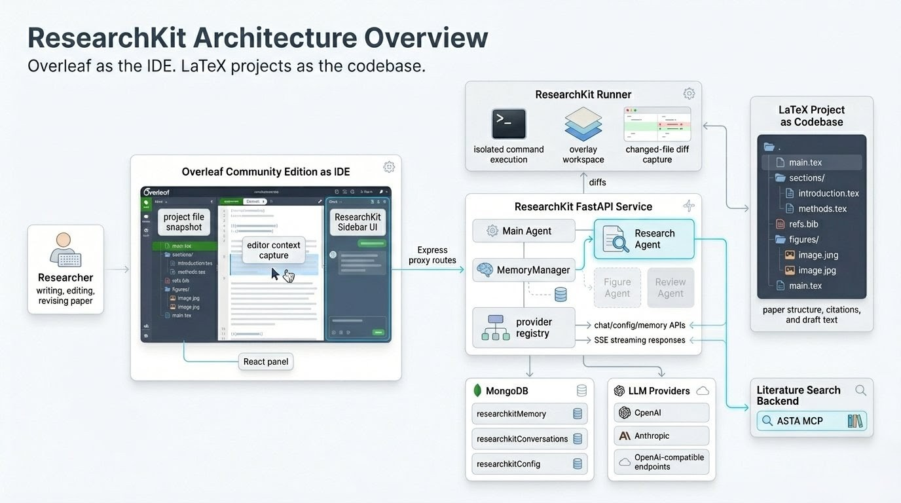

# ResearchKit

ResearchKit is an AI-assisted research writing environment built on top of Overleaf Community Edition. It treats Overleaf as the IDE and the LaTeX paper project as the codebase, then layers on a dedicated Python service, project-aware memory, provider configuration, inline patch review, and specialized agents for academic writing workflows.

## Documentation

- [Architecture](docs/architecture.md)
- [Current Features](docs/features.md)
- [Roadmap](docs/roadmap.md)
- [ResearchKit Service Guide](services/researchkit/README.md)



*ResearchKit architecture overview: Overleaf acts as the IDE, while the LaTeX project is treated as the codebase for agent-driven research writing workflows.*

## What It Does Today

- Treats Overleaf as the IDE and a LaTeX project as the codebase for agent-driven paper work
- Adds a ResearchKit sidebar inside the Overleaf editor
- Streams agent responses over SSE
- Captures editor context such as the active file, selected text, and cursor location
- Builds project memory from LaTeX structure and BibTeX files
- Persists conversations per project and supports resume, list, and clear flows
- Supports OpenAI, Anthropic, and OpenAI-compatible providers
- Lets users test provider settings and discover available models from the UI
- Produces inline patches and diff review actions for file changes
- Supports workspace-aware editing plus execution-oriented bash commands through the runner service
- Delegates literature-search tasks to an implemented Research Agent

## What Is Not Finished Yet

- Figure Agent is still a placeholder
- Review Agent is still a placeholder
- The broader multi-agent workflow is present, but only the Research Agent is meaningfully implemented today

## End-User Use Cases

- Turn rough notes into paper sections
  - Start from bullet points, experiment logs, or a draft paragraph and turn them into a cleaner introduction, method, or conclusion.
- Rewrite dense academic text faster
  - Paraphrase unclear paragraphs, improve flow, shorten overly long sections, or make writing sound more polished and consistent.
- Use the current draft as context
  - Ask for help on a specific selected paragraph or section, so the assistant responds in the context of the actual paper instead of giving generic writing advice.
- Build related work faster
  - Use the Research Agent to search literature and bring relevant papers into the writing workflow.
- Verify references before submission
  - Check whether citations look real, suspicious, or incomplete before they become submission-time problems.
- Revise with less copy-paste friction
  - Review suggested edits as patches and apply only the changes you want, directly in the paper workflow.
- Switch between AI providers without changing workflow
  - Use OpenAI, Anthropic, or an OpenAI-compatible endpoint depending on team preference, cost, or deployment constraints.

## System Overview

```text
+---------------------------+      +----------------------------+
| Overleaf Community        | ---> | ResearchKit FastAPI        |
| Edition                   |      | service                    |
| - ResearchKit sidebar UI  |      | - chat + config + memory   |
| - Express proxy routes    |      | - Main Agent               |
| - project file snapshot   |      | - Research Agent           |
+---------------------------+      | - MemoryManager            |
              |                    | - provider registry        |
              |                    +-------------+--------------+
              |                                  |
              v                                  v
+---------------------------+      +----------------------------+
| MongoDB                   |      | ResearchKit runner         |
| - researchkitMemory       |      | - isolated command exec    |
| - researchkitConversations|      | - overlay workspace diffs  |
| - researchkitConfig       |      +----------------------------+
+---------------------------+
```

Read the full breakdown in [docs/architecture.md](docs/architecture.md).

## Quick Start

### Prerequisites

- Docker and Docker Compose
- At least one LLM provider key
- Optional ASTA key for literature search features

### 1. Configure environment

```bash
cp .env.example .env
```

Set the provider credentials you need:

```bash
OPENAI_API_KEY=sk-...
ANTHROPIC_API_KEY=sk-ant-...
RESEARCHKIT_ASTA_API_KEY=...
```

Common optional settings:

```bash
RESEARCHKIT_PORT=3020
OPENAI_BASE_URL=http://your-proxy:4000
RESEARCHKIT_MODEL=gpt-4o
RESEARCHKIT_RUNNER_URL=http://researchkit-runner:3030
```

### 2. Start the stack

```bash
docker compose up -d --build
```

Main services:

| Service | Port | Purpose |
| --- | --- | --- |
| `sharelatex` | `80` | Overleaf UI |
| `researchkit` | `3020` | FastAPI backend |
| `researchkit-runner` | `3030` | command runner for bash tool execution |
| `mongo` | `27017` | shared persistence |
| `redis` | `6379` | Overleaf dependency |

### 3. Create an admin account

```bash
docker exec sharelatex /bin/bash -c "cd /overleaf/services/web && node modules/server-ce-scripts/scripts/create-user --admin --email=admin@example.com"
```

### 4. Open the app

1. Visit `http://localhost`
2. Log in and open a LaTeX project
3. Open the ResearchKit rail entry in the editor
4. Index the project or start chatting

## Development

### Full stack with Docker

```bash
docker compose up --build
```

### Python service with hot reload

Use this when working on agents, API routes, memory, or providers.

```bash
docker compose up sharelatex mongo redis

cd services/researchkit
python3 -m venv .venv
source .venv/bin/activate
pip install -e ".[dev]"

export MONGODB_URL="mongodb://localhost:27017/sharelatex"
export OPENAI_API_KEY="sk-..."
uvicorn researchkit.main:app --reload --host 0.0.0.0 --port 3020
```

### Frontend and proxy module

ResearchKit's Overleaf integration lives under `services/web/modules/researchkit/`.

For frontend work, use the normal Overleaf development flow:

```bash
cd develop
bin/build
bin/dev
```

## Current Runtime Flow

1. The Overleaf module captures project files and the active editor context.
2. ResearchKit treats that LaTeX workspace like a codebase, with files such as `main.tex`, section files, bibliography files, and figures forming the working project context.
3. The Express controller proxies requests to `researchkit`.
4. The FastAPI service loads provider config, refreshes memory when needed, and runs the `MainAgent`.
5. The Main Agent can edit files through `str_replace_editor`, run execution-only shell commands through the runner, or delegate literature work to the Research Agent.
6. The service streams `message`, `action`, `patch`, `response`, and `done` events back to the UI.

## Repository Pointers

- `services/researchkit/` contains the Python backend and runner
- `services/web/modules/researchkit/` contains the Overleaf proxy layer and React UI
- `docs/` contains project-level architecture, feature status, and roadmap docs

## Testing

Backend tests:

```bash
cd services/researchkit
pip install -e ".[dev]"
pytest -q tests
```

Current backend baseline: `67 passed`.

## Base Project

This repository is built on top of [Overleaf Community Edition](https://github.com/overleaf/overleaf). General Overleaf contribution guidance remains in [CONTRIBUTING.md](CONTRIBUTING.md).

## License

This project is licensed under the GNU Affero General Public License v3. See [LICENSE](LICENSE).
