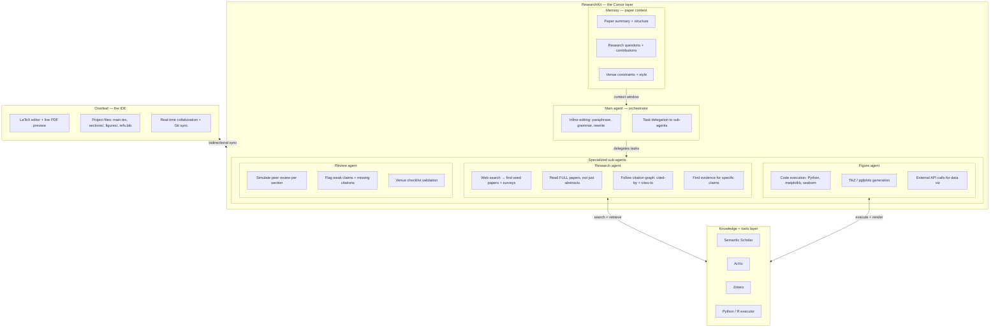

# ResearchKit

---

## 1. Executive Summary

ResearchKit is an open-source, agent-powered platform for end-to-end academic paper production. It adopts the **Cursor method** — using Overleaf as the IDE and layering an intelligent agent system on top — to give researchers the same kind of AI-augmented workflow that software engineers now take for granted.

The system is structured around three core components: **Memory** (persistent paper context), a **Main Agent** (handles inline editing and orchestrates work), and **specialized Sub-Agents** (Research, Figure, Review) that the Main Agent delegates to for deep, domain-specific tasks.

Where **OpenAI Prism** offers a polished but closed, monolithic workspace with a single model (GPT-5.2/5.3), ResearchKit takes a fundamentally different approach: it is **model-agnostic, agent-orchestrated, open-source, and Overleaf-native**. Researchers keep their existing Overleaf workflow, their institutional licenses, and their data sovereignty — while gaining a hierarchical agent system that goes far beyond what Prism offers.

**Tagline:** *"Cursor for researchers. Open-source. Agent-powered. Built on Overleaf."*

---

## 3. Vision & Positioning

### 3.1 Core Philosophy: The Cursor Method for Research

> **"Overleaf is the IDE. ResearchKit is Cursor."**
> 

Just as Cursor took VS Code (the IDE developers already use) and layered an intelligent agent system on top — with codebase memory, an inline editing agent, and specialized sub-agents for different tasks — ResearchKit does the same for academic writing:

| Cursor (for code) | ResearchKit (for research) |
| --- | --- |
| VS Code = the IDE | Overleaf = the IDE |
| Codebase index = memory | Paper summary + structure = memory |
| Inline agent (Tab, Cmd+K) = fast edits | Main Agent = paraphrase, grammar, inline editing |
| Background agents (multi-file edits, refactoring) | Sub-agents = Research, Figure, Review |
| `.cursor/` config | `.researchkit/config.yaml` |
| Repository = codebase | LaTeX project = codebase |

This is not a metaphor — it is the literal design pattern. Researchers should feel the same "flow state" that developers feel with Cursor: the AI is always there, always context-aware, handling the mechanical work while you focus on the ideas.

### 3.2 Strategic Positioning

```
                    Closed Source          Open Source
                   ┌─────────────────┬─────────────────┐
  Single Model /   │                 │                 │
  Chat-Based       │     Prism       │   Overleaf +    │
                   │    (OpenAI)     │   Writefull     │
                   ├─────────────────┼─────────────────┤
  Multi-Agent /    │                 │                 │
  Model-Agnostic   │   (no player)   │  ResearchKit ★  │
                   │                 │                 │
                   └─────────────────┴─────────────────┘
```

### 3.3 Differentiation Summary: ResearchKit vs. Prism

| Dimension | Prism (OpenAI) | ResearchKit |
| --- | --- | --- |
| **Architecture** | Monolithic, single-model chat | Hierarchical agents: Memory → Main Agent → Sub-Agents |
| **Source** | Closed-source, proprietary | Open-source (Apache 2.0) |
| **Base Platform** | Custom (acquired Crixet), replaces Overleaf | Extension layer on top of Overleaf |
| **Model Support** | GPT-5.2/5.3 only | Any LLM via provider abstraction (Claude, GPT, Gemini, Llama, local models) |
| **Data Sovereignty** | OpenAI servers only | Self-hostable; on-prem for institutions |
| **Context Awareness** | Project-aware chat | Persistent Memory: paper summary, research questions, venue constraints |
| **Inline Editing** | Chat-based suggestions | Main Agent: inline paraphrase, grammar, rewrite — like Cursor Tab |
| **Literature Review** | Basic search + citation | Research Agent: web search → seed surveys → read FULL papers → follow citation graph bidirectionally |
| **Paper Reading Depth** | Abstracts only | Full-paper reading with focus on relevant sections |
| **Figure Generation** | Whiteboard → LaTeX diagrams | Figure Agent: code execution (Python/R), TikZ gen, external API calls |
| **Quality Assurance** | None | Review Agent: simulates peer review, flags weak claims, validates checklists |
| **Rebuttal Support** | None | Main Agent delegates to Review Agent for rebuttal drafting |
| **Extensibility** | None (closed ecosystem) | Plugin/agent SDK, community-contributed sub-agents |
| **Pricing** | Free (premium features on paid ChatGPT tiers) | Free and open-source forever; optional managed cloud |
| **Offline Support** | No | Yes (with local models) |

---

## 4. Target Users
Researchers

---

## 5. Architecture: The Cursor Method

### 5.1 Architecture Overview



### 5.2 The Three Layers, Explained

**Layer 1: Overleaf (the IDE)**

Overleaf is to ResearchKit what VS Code is to Cursor. It provides the editor, the compiler, the PDF preview, the collaboration, and the Git backend. ResearchKit does not replace any of this — it rides on top. Researchers keep their existing Overleaf projects, institutional licenses, and muscle memory. ResearchKit initially ships as a browser extension, later as a server-side plugin for self-hosted Overleaf instances.

**Layer 2: ResearchKit (the Cursor layer)**

This is the intelligence layer, composed of three sub-components:

- **Memory** — persistent paper context (see §5.3)
- **Main Agent** — the primary interface for inline editing and orchestration (see §6.1)
- **Sub-Agents** — specialized agents for deep tasks: Research, Figure, Review (see §6.2–6.4)

**Layer 3: Knowledge & Tools**

External services and execution environments that agents call into: Semantic Scholar, ArXiv, Zotero, Python/R executors, TikZ compiler, BibTeX parser, venue template database, PDF parsers.

### 5.3 Memory: Paper Context as Codebase Index

Just as Cursor indexes your entire repository so every suggestion is context-aware, ResearchKit maintains a **Memory** — a structured, persistent representation of the paper that every agent reads from.

**What Memory contains:**

| Memory Component | Description | Cursor Analogy |
| --- | --- | --- |
| **Paper summary** | Auto-generated abstract of the paper's current state, updated on every significant edit | Codebase summary / embeddings index |
| **Structure map** | Section hierarchy, current page count, which sections are complete vs. drafts vs. empty | File tree + symbol index |
| **Research questions** | The paper's core research questions and claimed contributions | Project README / goal doc |
| **Venue constraints** | Target venue, page limits, formatting rules, required sections, checklist items | Build config / linter rules |
| **Citation context** | All referenced papers with mini-summaries, how each is used in the paper | Dependency graph |
| **Experiment context** | Links to data files, result tables, what experiments have been run | Test results / CI artifacts |
| **Style profile** | Learned writing style preferences (formal vs. concise, notation conventions, terminology) | Editor settings / .editorconfig |

**How Memory works:**

```yaml
# .researchkit/memory.yaml (auto-generated, human-readable)
paper_summary: |
  This paper proposes CodeWiki, a framework for automated repository-level
  documentation generation using hierarchical decomposition and multi-agent
  recursive processing. It supports 7 programming languages and achieves
  68.79% average quality score vs. DeepWiki's 64.06%.

research_questions:
  - "How can LLMs generate repository-level documentation that captures
     cross-file dependencies?"
  - "Does hierarchical decomposition improve documentation quality over
     flat approaches?"

contributions:
  - "A multi-agent recursive framework for repo-level doc generation"
  - "Support for 7 programming languages with language-agnostic design"
  - "18.54% improvement over DeepWiki on individual repositories"

venue:
  name: "ACL ARR 2025"
  type: long-paper
  page_limit: 8
  required_sections: [limitations, ethics]
  anonymous: true

structure:
  sections:
    - name: Introduction
      status: complete
      page_estimate: 1.2
    - name: Related Work
      status: draft
      page_estimate: 1.5
    - name: Methodology
      status: complete
      page_estimate: 2.3
    # ...

style_profile:
  formality: high
  notation_conventions:
    model_names: "\\textsc{}"
    math_variables: "italic lowercase"
  terminology:
    preferred: "repository-level" # not "repo-level" in body text
```

**Memory is always available to every agent.** When the Main Agent paraphrases a sentence, it knows the paper's notation conventions. When the Research Agent searches for related work, it knows the claimed contributions and can target gaps. When the Review Agent simulates a peer review, it knows the venue's checklist requirements. This shared context is what makes ResearchKit feel coherent rather than a bag of disconnected tools.

### 5.4 Core Principle: LaTeX Project as Codebase

Just as modern coding agents understand repository structure, ResearchKit agents understand paper structure:

- **`main.tex`** = entry point (like `main.py`)
- **`sections/*.tex`** = modules (like source files)
- **`figures/`** = generated assets (like build artifacts)
- **`refs.bib`** = dependency manifest (like `requirements.txt`)
- **`.researchkit/config.yaml`** = project config (like `.cursor/`, `.vscode/`)
- **`.researchkit/memory.yaml`** = paper context (like codebase index)
- **`experiment_data/`** = raw data inputs
- **Git history** = version control and diff-based review

Agents operate through structured edits (AST-level LaTeX manipulation), not string replacement — just as coding agents use tree-sitter, ResearchKit agents use LaTeX parsers.

### 5.5 Agent Communication Protocol

The Main Agent delegates to sub-agents using a structured protocol:

```yaml
# Main Agent → Sub-Agent Request
from: main_agent
to: research_agent
task: find_evidence_for_claim
context:
  claim: "LLM-based coding agents tend to patch inline rather than
          leveraging modular abstractions"
  memory_ref: .researchkit/memory.yaml
  current_refs: refs.bib
  constraints:
    max_papers: 20
    recency_bias: 0.7
    read_depth: full  # NOT abstract-only

# Sub-Agent → Main Agent Response
from: research_agent
status: completed
artifacts:
  - type: bibtex_entries
    path: refs_new.bib
    count: 12
  - type: evidence_report
    content: |
      Found 12 papers supporting this claim. Strongest evidence:
      - [Yang et al., 2025] found 73% of SWE-bench patches are inline...
      - [Survey: Chen et al., 2026] Section 4.2 discusses this pattern...
      3 papers partially contradict: they show agents DO extract helpers
      when explicitly prompted to refactor.
confidence: 0.88
needs_human_review: true
```

---

## 6. Feature Specification

### 6.1 Main Agent — The Orchestrator

The Main Agent is the researcher's primary interface — the equivalent of Cursor's inline agent (Tab completion, Cmd+K). It handles fast, frequent tasks directly and delegates deeper work to sub-agents.

**Direct capabilities (no delegation needed):**

| Feature | Description | Cursor Analogy |
| --- | --- | --- |
| **Inline paraphrase** | Select text → rewrite in place, preserving technical meaning and citation flow | Cursor Cmd+K rewrite |
| **Grammar correction** | Academic-specific grammar — detects hedging, passive voice overuse, vague claims. Not generic Grammarly. | Cursor lint-fix |
| **Section drafting** | Given an outline point + Memory context, drafts a section in LaTeX | Cursor "write this function" |
| **Coherence analysis** | Checks logical flow between paragraphs and sections, flags non-sequiturs | Cursor "explain this code" |
| **BibTeX management** | Normalizes entries, fixes formatting, resolves duplicate keys, validates DOIs | Cursor dependency management |
| **Format compliance** | Checks page limits, anonymization, venue-specific requirements | Cursor linter / CI checks |
| **Template migration** | One-click conversion between venue templates (e.g., NeurIPS → ICML) | Cursor "migrate this file" |
| **Table formatting** | Converts data (CSV, JSON) into LaTeX tables with auto-bolding and venue styles | Cursor "format this" |
| **Rebuttal drafting** | Parses reviewer comments, maps to sections, drafts point-by-point responses (delegates to Review Agent for quality checking) | N/A — unique to research |

**Delegation behavior:**

The Main Agent recognizes when a task requires deeper work and delegates:

| User Request | Main Agent Action |
| --- | --- |
| "Paraphrase this paragraph" | Handles directly (inline edit) |
| "Fix the grammar in Section 3" | Handles directly (inline edit) |
| "Find papers that support this claim" | **Delegates → Research Agent** |
| "Write the related work section" | **Delegates → Research Agent** (search + draft) |
| "Generate a bar chart from results.csv" | **Delegates → Figure Agent** |
| "Draw the model architecture diagram" | **Delegates → Figure Agent** |
| "Review this paper as if you're Reviewer 2" | **Delegates → Review Agent** |
| "Check if we meet the NeurIPS checklist" | **Delegates → Review Agent** |
| "Help me respond to the reviewers" | Drafts rebuttal, **delegates to Review Agent** for quality validation |

### 6.2 Research Agent — Deep Literature Discovery

**This is where ResearchKit most dramatically exceeds Prism, and where the design reflects how real researchers actually work.**

Prism's literature search is a flat keyword lookup that returns abstracts. The Research Agent mirrors the actual researcher workflow:

### 6.2.1 The Real Researcher Workflow (What the Agent Replicates)

```
Step 1: SEED DISCOVERY
  └─ Web search (Google Scholar, Semantic Scholar) for the topic
  └─ Identify 3-5 seed papers, ESPECIALLY survey papers
  └─ Survey papers are gold — they organize the entire field

Step 2: DEEP READING (not abstract skimming)
  └─ Read each seed paper ENTIRELY
  └─ Focus heavily on: Related Work section, Methodology, Results
  └─ Extract: what methods exist, what benchmarks are used,
     what gaps the authors identify

Step 3: FORWARD CITATION CHAIN (papers that cite the seeds)
  └─ "Who built on this work?"
  └─ Find more recent papers that extended or challenged the seeds
  └─ These are your direct competitors and context

Step 4: BACKWARD CITATION CHAIN (papers the seeds cite)
  └─ "What foundations does this build on?"
  └─ Find the seminal works and key baselines
  └─ These are your required references

Step 5: EVIDENCE GATHERING
  └─ For each claim in YOUR paper, find papers that support it
  └─ For each unsupported claim, flag it
  └─ For contradictory evidence, surface it (don't hide it)
```

### 6.2.2 Research Agent Capabilities

| Feature | Description | Why It Matters |
| --- | --- | --- |
| **Web search → seed discovery** | Uses web search to find seed papers and especially survey papers on the topic | Survey papers organize the entire field — one good survey replaces hours of manual search |
| **Full-paper reading** | Downloads and reads ENTIRE papers via PDF parsing — not just titles and abstracts | Abstracts lie. The methodology section reveals whether a paper is actually relevant. Related Work sections reveal the field's structure. |
| **Survey paper prioritization** | Identifies and prioritizes survey/review papers, which serve as maps of the field | A survey's related work section is a curated bibliography — the Research Agent treats it as a high-value index |
| **Forward citation graph** | For each seed paper, finds papers that cite it (via Semantic Scholar API) | "Who built on this?" reveals your competitors and the state of the art |
| **Backward citation graph** | For each seed paper, reads its references and follows relevant ones | "What did this build on?" reveals the foundations you must cite |
| **Claim-evidence matching** | Given a claim from your paper, searches for papers that support or contradict it | Every claim in a paper should be backed by evidence. This automates the tedious verification |
| **Gap analysis** | Identifies what existing work does NOT cover, maps your contribution to the gap | The "what's missing" argument is the core of every Introduction — the agent finds it from the literature |
| **Related work section generation** | Produces a structured related work section with proper grouping, transitions, and citations | Not a dump of summaries — a narrative that positions your work in the field |
| **Citation validation** | Verifies every BibTeX entry: correct DOI, author names, venue, year. Detects hallucinated references. | Hallucinated citations are the #1 AI-assisted writing failure. This agent prevents it. |

### 6.2.3 Research Agent Flow (Detailed)

```
User: "Find related work for our code documentation generation paper"
                    │
                    ▼
┌─────────────────────────────────────────────────────────────────┐
│  Step 1: SEED DISCOVERY                                         │
│  ├─ Web search: "automated code documentation generation LLM"  │
│  ├─ Web search: "repository-level documentation survey"         │
│  ├─ Semantic Scholar: topic search + sort by citation count     │
│  └─ Result: 8 seed papers identified, 2 are surveys            │
└─────────────────────────────┬───────────────────────────────────┘
                              ▼
┌─────────────────────────────────────────────────────────────────┐
│  Step 2: DEEP READ (surveys first)                              │
│  ├─ Download PDF of each seed paper                             │
│  ├─ Parse full text (not just abstract)                         │
│  ├─ Focus on: Related Work, Methodology, Limitations sections   │
│  ├─ Extract: methods taxonomy, benchmarks, identified gaps      │
│  └─ From Survey A, Section 3: identifies 4 method categories    │
└─────────────────────────────┬───────────────────────────────────┘
                              ▼
┌─────────────────────────────────────────────────────────────────┐
│  Step 3: CITATION GRAPH TRAVERSAL                               │
│  ├─ Forward: "Who cited Survey A?" → 47 papers, filter to 12   │
│  ├─ Backward: "Survey A cites these" → 89 refs, filter to 15   │
│  ├─ Read the most relevant ones (full paper, not abstract)      │
│  └─ Repeat for each highly relevant paper (depth limit: 2 hops)│
└─────────────────────────────┬───────────────────────────────────┘
                              ▼
┌─────────────────────────────────────────────────────────────────┐
│  Step 4: SYNTHESIZE                                             │
│  ├─ Group papers into categories (from survey taxonomy)         │
│  ├─ Identify gap: "No existing work handles repo-level with     │
│  │   hierarchical decomposition across 7 languages"             │
│  ├─ Generate related_work.tex with proper LaTeX citations       │
│  ├─ Generate new BibTeX entries                                 │
│  └─ Produce evidence report for human review                    │
└─────────────────────────────────────────────────────────────────┘
```

### 6.3 Figure Agent — Visual Assets via Code Execution

The Figure Agent generates publication-quality figures through code execution and diagram generation — treating figures as build artifacts, not manual art.

| Feature | Description |
| --- | --- |
| **Data → plots (code execution)** | Given CSV/JSON experiment data, writes and executes Python (matplotlib, seaborn, plotly) or R code to generate publication-quality plots. Outputs PDF/PNG to `figures/`. |
| **TikZ / pgfplots generation** | Natural language → TikZ code for architecture diagrams, flowcharts, neural network diagrams, algorithm visualizations |
| **External API / tool calls** | Calls external visualization services, plotting APIs, or diagramming tools when code execution alone isn't sufficient |
| **Whiteboard → figure** | Image input → structured diagram (similar to Prism's sketch-to-LaTeX, but outputs both TikZ and raster formats) |
| **Figure captioning** | Generates descriptive captions following venue conventions |
| **Style consistency** | Reads Memory style profile to ensure all figures use consistent fonts, colors, sizing, and notation across the paper |
| **Accessibility check** | Verifies colorblind-safe palettes, sufficient contrast, readable font sizes |
| **Iterative refinement** | Maintains the generation code so figures can be re-run with updated data or style changes |

**Figure Agent execution model:**

```
User: "Create a bar chart comparing our method vs baselines on HumanEval"
                    │
    Main Agent delegates to Figure Agent
                    │
                    ▼
┌─────────────────────────────────────────────┐
│  1. Read Memory for:                        │
│     - experiment data location              │
│     - style profile (colors, fonts)         │
│     - venue figure size requirements        │
│                                             │
│  2. Generate Python code:                   │
│     - Load results.csv                      │
│     - matplotlib bar chart with error bars  │
│     - Apply paper's color scheme            │
│     - Bold best result                      │
│     - Export as figures/humaneval_bar.pdf    │
│                                             │
│  3. Execute code in sandbox                 │
│                                             │
│  4. Generate LaTeX include:                 │
│     \begin{figure}[t]                       │
│       \includegraphics{figures/humaneval}    │
│       \caption{Performance comparison...}   │
│     \end{figure}                            │
│                                             │
│  5. Save generation script for re-runs:     │
│     figures/scripts/humaneval_bar.py         │
└─────────────────────────────────────────────┘
```

### 6.4 Review Agent — Synthetic Peer Review

The Review Agent simulates the peer review process, acting as "Reviewer 2" before real reviewers see the paper. This catches weaknesses early and improves acceptance rates.

| Feature | Description |
| --- | --- |
| **Section-by-section review** | Reads each section with Memory context and generates reviewer-style feedback: strengths, weaknesses, questions |
| **Claim strength analysis** | For each claim in the paper, assesses whether the evidence (experiments, citations, proofs) is sufficient |
| **Missing citation detection** | Scans text for claims that should be cited but aren't — delegates to Research Agent if evidence is needed |
| **Venue checklist validation** | Validates venue-specific checklists (NeurIPS reproducibility checklist, ACL responsible NLP checklist, AAAI ethics checklist) |
| **Consistency checking** | Cross-references claims in abstract vs. introduction vs. conclusion — flags contradictions or drift |
| **Readability scoring** | Academic readability metrics with section-level breakdown |
| **Rebuttal quality check** | When Main Agent drafts a rebuttal, Review Agent validates: Are all concerns addressed? Is tone appropriate? Are promises realistic? |
| **Simulated scores** | Generates predicted reviewer scores with rationale (confidence-calibrated) |

**Review Agent output format:**

```markdown
## Simulated Review: CodeWiki Paper

### Summary
The paper presents CodeWiki, a multi-agent framework for repo-level
documentation generation. The approach is novel in its hierarchical
decomposition strategy.

### Strengths
1. [S1] Comprehensive evaluation across 7 programming languages
2. [S2] Clear improvement over DeepWiki baseline (18.54%)
3. [S3] Open-source release enables reproducibility

### Weaknesses
1. [W1] Missing comparison with OpenDeepWiki (released Dec 2025)
   → Section: Related Work, Experiments
   → Severity: Major
   → Suggestion: Add OpenDeepWiki as a baseline

2. [W2] Data leakage concern: training repos may overlap with
   benchmark repos
   → Section: Experiments
   → Severity: Major
   → Suggestion: Add a data leakage prevention table

3. [W3] No human evaluation of generated documentation quality
   → Section: Experiments
   → Severity: Minor
   → Suggestion: Add a pilot human study (even small-scale)

### Questions for Authors
- Q1: How does the system handle cross-repository dependencies?
- Q2: What is the latency per repository?

### Predicted Score: 5/10 (Borderline)
### Confidence: 3/5
```

---

## 7. Technical Design

### 7.1 Provider Abstraction

Each agent can use a different model optimized for its task:

```python
# researchkit/providers/base.py
class LLMProvider(ABC):
    @abstractmethod
    async def complete(self, messages, tools=None, **kwargs) -> Response: ...

    @abstractmethod
    async def embed(self, texts: list[str]) -> list[list[float]]: ...

# Concrete implementations
class ClaudeProvider(LLMProvider): ...
class OpenAIProvider(LLMProvider): ...
class GeminiProvider(LLMProvider): ...
class OllamaProvider(LLMProvider): ...  # Local models
```

### 7.2 Agent Framework

```python
# researchkit/agents/base.py
class SubAgent(ABC):
    """Base class for specialized sub-agents."""
    name: str
    description: str
    required_tools: list[Tool]
    provider: LLMProvider

    @abstractmethod
    async def plan(self, task: Task, memory: Memory) -> Plan: ...

    @abstractmethod
    async def execute(self, plan: Plan) -> Result: ...

    async def validate(self, result: Result) -> ValidationReport: ...

class MainAgent:
    """The orchestrator. Handles inline tasks directly,
    delegates complex tasks to sub-agents."""
    memory: Memory
    sub_agents: dict[str, SubAgent]  # research, figure, review
    provider: LLMProvider

    async def handle(self, request: UserRequest) -> Response:
        if self.can_handle_inline(request):
            return await self.inline_edit(request)
        else:
            agent = self.select_sub_agent(request)
            task = self.prepare_task(request, self.memory)
            return await agent.execute(task)

# Concrete sub-agents
class ResearchAgent(SubAgent):
    """Deep literature discovery with full-paper reading."""
    tools = [SemanticScholarTool, ArXivTool, PDFParserTool, WebSearchTool]
    ...

class FigureAgent(SubAgent):
    """Code execution for figures and TikZ generation."""
    tools = [PythonExecutorTool, TikZCompilerTool, ExternalAPITool]
    ...

class ReviewAgent(SubAgent):
    """Simulated peer review and quality assurance."""
    tools = [CitationValidatorTool, ChecklistTool]
    ...
```

### 7.3 Memory System

```python
# researchkit/memory/memory.py
class Memory:
    """Persistent paper context — the codebase index for research."""

    paper_summary: str           # Auto-generated, updated on edits
    structure: PaperStructure    # Section hierarchy, status, page estimates
    research_questions: list[str]
    contributions: list[str]
    venue: VenueConfig
    citation_context: dict[str, CitationSummary]
    experiment_context: ExperimentContext
    style_profile: StyleProfile

    def update_from_project(self, project: LaTeXProject) -> None:
        """Re-index the paper after edits (like Cursor re-indexing)."""
        ...

    def get_context_for_agent(self, agent_name: str) -> dict:
        """Returns the relevant subset of memory for a specific agent."""
        ...

    def to_yaml(self) -> str:
        """Serialize to .researchkit/memory.yaml for human inspection."""
        ...
```

### 7.4 LaTeX AST Layer

```python
# researchkit/latex/parser.py
class LaTeXProject:
    """Treats a LaTeX project like a codebase AST."""

    def get_sections(self) -> list[Section]: ...
    def get_citations(self) -> list[Citation]: ...
    def get_figures(self) -> list[Figure]: ...
    def get_tables(self) -> list[Table]: ...
    def get_claims(self) -> list[Claim]: ...  # Extracts assertive statements
    def apply_edit(self, edit: StructuredEdit) -> Diff: ...
    def compile(self) -> CompileResult: ...
```

### 7.5 Configuration

```yaml
# .researchkit/config.yaml
project:
  name: "My ACL 2026 Paper"
  venue: "acl-2026"
  type: "long-paper"
  page_limit: 8
  anonymous: true

providers:
  main_agent: claude-sonnet-4      # Fast, good at inline edits
  research_agent: claude-opus-4    # Strongest model for deep reasoning + full-paper reading
  figure_agent: claude-sonnet-4    # Good at code generation
  review_agent: claude-opus-4      # Needs deep reasoning for quality assessment

agents:
  research:
    sources: [semantic_scholar, arxiv, dblp, google_scholar]
    search_strategy: survey_first  # Prioritize survey papers
    read_depth: full               # Read entire papers, not just abstracts
    citation_graph_hops: 2         # How deep to follow citation chains
    max_papers: 50
    recency_weight: 0.7
  figure:
    default_style: matplotlib
    color_palette: colorblind_safe
    output_format: pdf
    save_scripts: true             # Keep generation scripts for re-runs
  review:
    simulate_reviewers: 3          # Number of simulated reviewers
    venue_checklist: auto          # Auto-detect from venue config
    severity_threshold: minor      # Flag issues at this level and above

integrations:
  overleaf:
    project_id: "abc123"
    sync_mode: bidirectional
  zotero:
    library_id: "xyz789"
```

---

## 8. Integration Strategy

User can config directly base_url, api_key then select model name, or using claude subscription (claude sdk) or codex subscription (codex sdk) so in UI user can authen via their claude or chatgpt subscription instead of getting api key
see docs via contex7 pull docs skill

---

## 14. Appendix: Sample User Flows

### Flow A: "I have experiment results. Help me write the paper."

1. User opens their Overleaf project. ResearchKit browser extension activates.
2. Memory auto-indexes the project: detects venue (ACL 2026), extracts existing structure.
3. User highlights a TODO in Introduction. **Main Agent** drafts the paragraph inline.
4. User types: "Find related work for code documentation generation."
5. **Main Agent** delegates to **Research Agent**.
6. Research Agent: web search → finds 2 surveys + 6 seed papers → reads all 8 in full → follows citation graph (12 forward, 15 backward) → filters to 24 relevant papers → generates `related_work.tex` with grouped citations.
7. User uploads `results.csv`. Types: "Create comparison bar chart."
8. **Main Agent** delegates to **Figure Agent**.
9. Figure Agent: reads Memory for style profile → writes matplotlib script → executes → outputs `figures/comparison.pdf` + LaTeX include block. Saves script for re-runs.
10. User finishes draft. Types: "Review this paper."
11. **Main Agent** delegates to **Review Agent**.
12. Review Agent: reads entire paper with Memory context → generates 3 simulated reviews → identifies: missing baseline (OpenDeepWiki), data leakage concern, no human study → predicted score: 5/10.
13. User addresses the weaknesses. Re-runs Review Agent. Score improves to 7/10.
14. User submits. Time saved: estimated 60% reduction in mechanical work.

### Flow B: "We got reviews back. Help me write the rebuttal."

1. User pastes OpenReview comments into ResearchKit.
2. **Main Agent** parses reviews into structured concerns, maps each to paper sections using Memory.
3. Main Agent drafts point-by-point responses.
4. **Main Agent** delegates response quality check to **Review Agent**: "Are all concerns addressed? Is tone appropriate? Are promises realistic?"
5. Review Agent flags: "Response to W2 promises new experiments but doesn't specify which. Reviewer will push back."
6. User adds new experiment results. **Main Agent** delegates to **Figure Agent** for updated plots.
7. Main Agent produces color-coded diff of paper changes.
8. User reviews, refines tone, submits.

### Flow C: "Find evidence that LLM agents patch inline rather than using modular abstractions."

1. User highlights a claim in their paper. Types: "Find evidence for this."
2. **Main Agent** delegates to **Research Agent** with the claim text + Memory context.
3. Research Agent: web search for the topic → finds 3 relevant survey papers → reads them in full → follows citation chains → identifies 12 papers with evidence.
4. Research Agent returns an evidence report: 9 papers support the claim (with specific sections cited), 3 papers partially contradict (agents DO refactor when explicitly prompted).
5. Research Agent generates BibTeX entries and suggests inline citation placements.
6. User reviews and accepts, with full confidence that the evidence is real (not hallucinated).

---

*ResearchKit is not about replacing researchers. It's about giving every researcher — from a first-year PhD student in Hanoi to a senior professor at MIT — the same caliber of tooling that was previously only possible with a large, experienced team. Open-source. Agent-powered. Built on the tools researchers already use.*

*Overleaf is the IDE. ResearchKit is Cursor. Memory is the codebase index. The Main Agent is your inline companion. The Sub-Agents are your research team.*